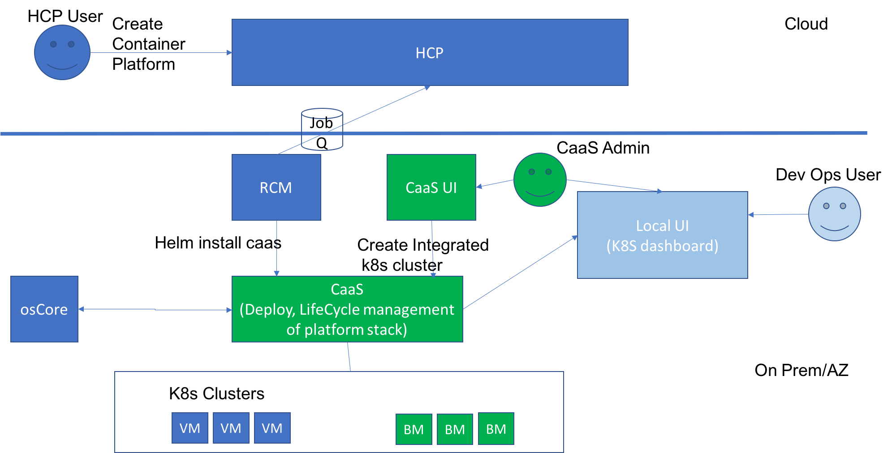

# Harmony : Detailed Architecture Notes

Logically, a CaaS domain contains compute nodes (bare-metal or VM) to form a _cluster_, as well as additional nodes that might be needed to support the container stack in the domain (for storage etc.) This domain is deployed and managed by CaaS Deployment and Management (DM) service also known as CX for short.

Following figure shows a high level architecture of these components.

[https://gcc-elb-public-prod.gliffy.net/embed/image/0ec885abd6d2ecd9e0689546220d5ac3.png?utm_medium=live&utm_source=custom]()

CX service runs on top of K8S cluster provided by Sparta alongside osCore, RCM and other components. It exposes APIs that allows authorized users to create and manage _CaaS domains _ in a Harmony deployment.

Each domain, also referred to as a cluster, provides a collection of compute resources(VMs/Baremetal) and runs a container stack, such as OpenShift. These container platforms may rely on ancillary services provided by Harmony platform, such as monitoring, user ID management, and storage (NFS).

# Design Details

## CX API

### CRUD operations on CaaS Domain (Cluster)

1. Create cluster
  * configures a set of nodes to form a cluster.
  *  Sets up a container stack, such as kubernetes or openshift.
  * Requires caller to have minimum CX admin role.
* Delete cluster
  * Requires caller to have minimum CX admin role.
* Update cluster
  * Add node(s)
  * Remove node(s)
  * Node OS upgrades
  * Cluster stack upgrade
  * Requires caller to have minimum CX admin role
* Get cluster URI.
  * Requires caller to have minimum CX user role.

See RBAC section later for more details on roles and associated capabilities.

## Networking

Note: This section has the high level problem definition. Refer to the following wiki page ([Harmony KaaS Networking](Harmony-KaaS-Networking_192170421.html)) for the latest documentation wrt Harmony networking.

Following flows of communication are expected:

1. Access to CX APIs from harmony portal
2. Communication between nodes for K8s control plane
3. Exposing **external access** to k8s api service endpoint
4. Communication between CX and domain nodes for cluster management (kubeadm workflows)
5. Communication between containers in a cluster. This communication will be policy controlled - a set of containers will be explicitly allowed to communicate with other set as per the needs of deployed application
6. Northbound access to services running in containers in a cluster
7. Communication between containers and hosts in a cluster

5-7 require a capable multi-host, policy-based, container networking fabric. We plan to use [Contiv](http://github.contiv.io) for this purpose. Contiv uses open virtual switch (OVS) for data plane on each cluster node. It supports L2 + ACI integration, L3 BGP, and VXLAN for container networking modes. Inter-container communication control is accomplished via creating separate networks for different groups of containers, and controlling routing between these networks based on policy. For MVP, we will focus on L2 and VXLAN modes only for container communication.

The following figure shows various networks in operation in a CaaS domain:

[https://gcc-elb-public-prod.gliffy.net/embed/image/0ec885abd6d2ecd9e0689546220d5ac3.png?utm_medium=live&utm_source=custom]()

ctrl network connects nodes in domain for k8s orchestration and Contiv management. data network connects nodes in _cluster_ (may not be all nodes in a domain). Harmony Network Service (HNS) will configure interfaces on each node to connect to these networks as required. For data network, the interface must be configured in **trunk** mode. This interface will be controlled by Contiv's OVS component, and will be used for container networking.

Based on container stack requirements, further networks may be required, e.g., for storage, and will be configured on nodes by CaaS DM service appropriately.

## Role-Based Access Control

User's ID is provided by an external ID provider, such as active directory. CaaS domain provides role-based access control of each cluster as a resource, as well as global, domain-level operations.

Role definitions - T.B.D.

## Container Stacks

We expect to support following container stacks for deployment in a CaaS domain

1.  Vanilla K8s - v1
2.  OpenShift - v1
3.  Docker Datacenter - Post v1

# CaaS DM Service Deployment

CaaS DM service containers are deployed on osCore control cluster running kubernetes. In particular, the deployment is a helm chart, installed as

<pre>helm install cx</pre>

# CaaS Interaction with HCP/RCM/osCore and end users

CaaS will be install in an on prem availability zone by RCM which pulls down a job queue from HCP.

CaaS control plane life cycle management (upgrade, backups?, security, etc) will be managed by RCM.

CaaS will expose a UI using which the end user will perform cluster management operations. CaaS will also expose a platform specific local UI (k8s dashboard) for the consumers of the cluster platform stack. CaaS will handle lifecycle management for the cluster platform stack.

# Implementation Details

## MVP Specifics

For MVP, CaaS DM service will be deployed alongside osCore. As osCore deployment is also containerized, and is expected to be installed on the k8s control cluster using helm, it should be possible to install the helm chart for CaaS mgmt service on the same k8s control cluster.

CaaS DM service will be configured to use osCore API endpoint. It will call into osCore to:

1.  Create a tenant (project) on Domain create
2.  Allocate nodes in the tenant to add to domain
3.  Create networking resources for the domain

For an example workflow, see [Sample](https://cto-github.cisco.com/bradjone/bifrost-k8s-install/blob/domain-deploy/domain_scripts/deploy_caas.sh) script. It shows the kind of API interaction that CaaS DM will have with osCore.

# Open Items

Domain Upgrade

1.  New version of k8s on control cluster
2.  Node s/w updates, reboots
