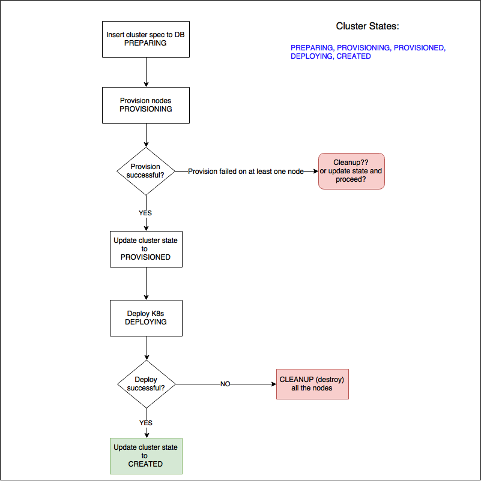

# Harmony : Cluster API Design + Profiles

**NOTE: Please note this is a high-level design we may add/delete attributes or structs when we do the actual implementation.
**

#### High Level Structure

<pre class="syntaxhighlighter-pre" data-syntaxhighlighter-params="brush: cpp; gutter: false; theme: Emacs" data-theme="Emacs">// NOTE: NetworkSpec, NodeSpec, StorageSpec are generic types. They're common all the driver types.
// Driver specific attributes go in `OpenstackInfra`, `VsphereInfra`, etc.

type Label struct {
	Key   string `json:"key"`
	Value string `json:"value"`
}

// Generic NodeSpec for all the backend drivers
type NodeSpec struct {
	Template string `json:"template"` // image, ova, etc.
	SSHUser  string `json:"ssh_user"`
}

// Generic NetworkSpec for all the backend drivers
type NetworkSpec struct {
	ExternalNetwork string `json:"external_network"` // this is where the master node will get the floating IP from
	InternalNetwork string `json:"internal_network"` // this parameter needs to go away once we starting creating a network per cluster
}

// Generic StorageSpec for all the backend drivers
type StorageSpec struct {
	// this varies based on the backend driver
	// TODO: We're yet to design this module
}

type InfraSpec struct {
	Labels []Label `json:"labels"` // additional params to be passed to external plugins (contiv, zeus) e.g. contiv_subnet=x.x.x.x/24, contiv_gateway=x.x.x.x, fwd_mode=routing, keystone_project_id=adfasdf
	NodeSpec
	NetworkSpec
	StorageSpec
}

// openstack specific attributes go here and this is object that goes to DB
type OpenstackInfra struct {
	ClusterUUID  string    `json:"-"`             // this is a foreign key
	MasterFlavor string    `json:"master_flavor"` // e.g. m1.large, m1.medium for openstack nodes
	WorkerFlavor string    `json:"worker_flavor"` // e.g. m1.large, m1.medium for openstack nodes
	SSHKeyName   string    `json:"ssh_key_name"`  // the name of the SSH keypair to configure in the cluster servers for ssh access.
	ProjectID    string    `json:"project_id"`
	Spec         InfraSpec `json:"spec"`
	SpecID       int       `json:"spec_id"`
}

// vsphere specific attributes
type VsphereInfra struct {
	ClusterUUID   string    `json:"-"` // this is a foreign key
	MasterFlavor  string    `json:"master_flavor"`
	WorkerFlavor  string    `json:"worker_flavor"`
	DatastoreName string    `json:"datastore_name"` // name of the vsphere datastore
	Spec          InfraSpec `json:"spec"`
	SpecID        int       `json:"spec_id"`
}

type Node struct {
	UUID        string `json:"uuid"` // unique identifier
	ClusterUUID string `json:"-"`    // this is a foreign key
	Name        string `json:"name"`
	PublicIP    string `json:"public_ip"`
	PrivateIP   string `json:"private_ip"`
	IsMaster    bool   `json:"is_master"`
}

// Cluster indicates the v2 cluster object
type Cluster struct {
	UUID                     string         `json:"uuid"`                        // unique identifier
	ProviderClientConfigUUID string         `json:"provider_client_config_uuid"` // foreign key of ProviderClientConfig.UUID
	Name                     string         `json:"name"`
	Description              string         `json:"description"`
	NumHosts                 int            `json:"num_hosts"`
	NumMasters               int            `json:"num_masters"`
	Type                     v1.ClusterType `json:"type"` // e.g. Openstack, AWS, VSphere
	K8sToken                 string         `json:"-"`
	Infra                    interface{}    `json:"infra" sql:"-"` // this does not denote struct `InfraSpec`. this could be struct Openstack, Vsphere, Aws, etc.
	Nodes                    []Node         `json:"nodes" sql:"-"`
}
</pre>

### ProviderClientConfig

Manages the provider client config of each backend driver we support. They're reusable and the users can associate a config with multiple clusters.

#### High level struct

<pre class="syntaxhighlighter-pre" data-syntaxhighlighter-params="brush: cpp; gutter: false; theme: Emacs" data-theme="Emacs">// ProviderClientConfig represents the config for reaching the specific cloud provider
type ProviderClientConfig struct {
	UUID   string         `json:"uuid"`
	Type   v1.ClusterType `json:"type"`           // e.g. Openstack, AWS, VSphere
	Config interface{}    `json:"config" sql:"-"` // config to connect to the backend of type `Type`. This needs to be typed to OpenstackClientConfig, VSphereClientConfig, etc.
}

// this is the config CX will use to connect to Openstack
type OpenstackClientConfig struct {
	ProviderClientConfigUUID string `json:"provider_client_config_uuid"` // foreign key of ProviderClientConfig.UUID
	AuthURL                  string `json:"auth_url"`
	Username                 string `json:"username"`
	Password                 string `json:"password"`
}

// this is the config CX will use to connect to Vsphere
type VsphereClientConfig struct {
	ProviderClientConfigUUID string `json:"provider_client_config_uuid"` // foreign key of ProviderClientConfig.UUID
	IP                       string `json:"ip"`                          // vCenter URL Ex: x.x.x.x or myvcenter.io
	Port                     string `json:"port"`                        // vCenter port
	Username                 string `json:"username"`                    // vCenter username
	Password                 string `sql:"size:4096" json:"password"`    // vCenter password
	Datacenter               string `json:"datacenter""`                 // Datacenter in vCenter to use
	HostSystem               string `json:"host_system"`
	Pool                     string `json:"pool"` // vCenter resource pool name
}</pre>

### DB Design

There will be a ClientConfig, driver(Openstack, Aws, Azure, etc..) table for each backend we support.

### Sample Create Cluster Request

<pre class="syntaxhighlighter-pre" data-syntaxhighlighter-params="brush: bash; gutter: false; theme: Eclipse" data-theme="Eclipse">{  
  "name":"sample_k8s_cluster",
  "description":"K8s cluster for dev",
  "provider_client_config_uuid":"asfdadfafds343512",
  "num_hosts":3,
  "num_masters":2,
  "type":1,
  "infra":{  
    "master_flavor":"m1.large",
    "worker_flavor":"m1.small",
    "ssh_key_name":"cx-sddc",
    "project_id":"245235245sfsdfsdfsdf",
    "spec":{  
      "template":"ubuntu-xenial",
      "ssh_user":"cloud",
      "external_network":"public",
      "internal_network":"private",
      "labels":[  
        {  
          "contiv_subnet":"10.0.2.0/24"
        },
        {  
          "contiv_gateway":"10.0.2.254"
        }
      ]
    }
  }
}</pre>

### Create Cluster Workflow

